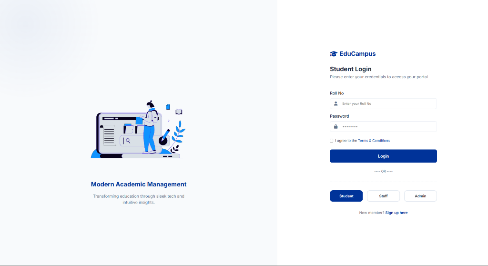
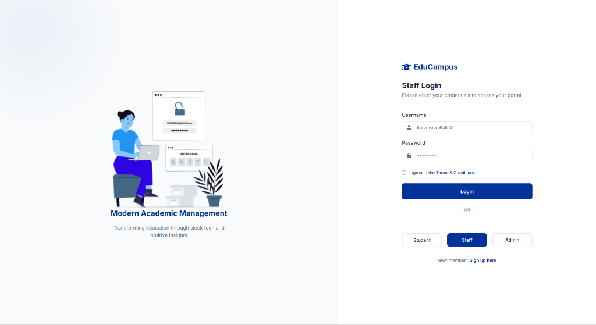
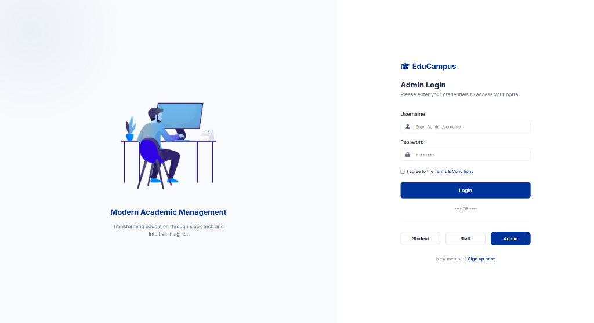
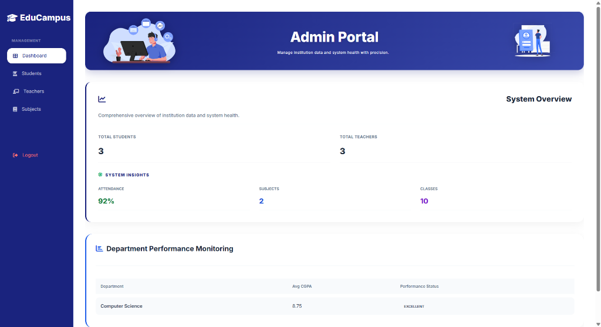
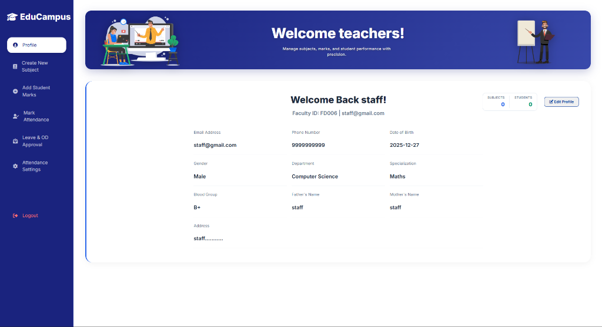

# 🎓 EduCampus - Student Management System

<div align="center">


[](https://spring.io/projects/spring-boot)
[](https://www.oracle.com/java/)
[](https://www.mysql.com/)
[](LICENSE)

**A modern, full-featured student management system with role-based dashboards, attendance tracking, and comprehensive analytics.**

[Features](#-features) • [Screenshots](#-screenshots) • [Tech Stack](#-tech-stack) • [Installation](#-installation) • [Usage](#-usage) • [Testing](#-testing)

</div>

---

## 📋 Table of Contents

- [Overview](#-overview)
- [Features](#-features)
- [Screenshots](#-screenshots)
- [Tech Stack](#-tech-stack)
- [Architecture](#-architecture)
- [Installation](#-installation)
- [Configuration](#-configuration)
- [Usage](#-usage)
- [Testing](#-testing)
- [API Documentation](#-api-documentation)
- [Contributing](#-contributing)
- [License](#-license)

---

## 🌟 Overview

EduCampus is a comprehensive student management system designed for educational institutions. It provides separate dashboards for students, teachers, and administrators, with features including attendance tracking, marks management, leave requests, and detailed analytics.

### Key Highlights

- ✅ **Role-Based Access Control** - Separate dashboards for Students, Teachers, and Admins
- ✅ **Modern UI/UX** - Professional, responsive design with smooth animations
- ✅ **Attendance System** - 8-period daily tracking with analytics
- ✅ **Leave Management** - Request and approval workflow
- ✅ **Marks & Results** - GPA calculation and semester-wise results
- ✅ **JWT Authentication** - Secure token-based authentication
- ✅ **Responsive Design** - Works on all devices (desktop, tablet, mobile)
- ✅ **Comprehensive Testing** - 70%+ test coverage with 40+ test cases

---

## ✨ Features

### 👨‍🎓 Student Dashboard

- **Profile Management** - View and edit personal information
- **Attendance Tracking** - Real-time attendance percentage with eligibility status
- **Marks & Results** - View semester-wise marks, GPA, and CGPA
- **Leave Requests** - Submit and track leave/OD requests
- **Analytics** - Visual representation of academic performance

### 👨‍🏫 Teacher Dashboard

- **Student Management** - View and manage student records
- **Attendance Marking** - Mark attendance for 8 periods daily
- **Marks Entry** - Enter and update student marks
- **Leave Approval** - Review and approve/reject leave requests
- **Profile Management** - Manage personal and professional details

### 👨‍💼 Admin Dashboard

- **User Management** - Create and manage students, teachers, and admins
- **Department Management** - Organize by departments and semesters
- **Subject Management** - Add and assign subjects
- **Analytics Dashboard** - System-wide statistics and insights
- **Bulk Operations** - Efficient management of multiple records

### 🔐 Security Features

- JWT-based authentication
- Role-based authorization
- Password encryption (BCrypt)
- Temporary password system with forced change
- Session management
- CORS configuration

---

## 📸 Screenshots

### Login Pages
<div align="center">

#### Student Login

*Modern login interface for students with roll number authentication*

#### Teacher Login

*Staff login portal with faculty ID authentication*

#### Admin Login

*Administrative login with secure access control*

</div>

### Dashboards

#### Student Dashboard

*Student portal with attendance tracking, GPA overview, and academic profile*

#### Admin Dashboard

*Comprehensive admin dashboard with system overview and analytics*

#### Teacher Dashboard

*Teacher portal for managing students, attendance, and marks*

> **Note:** More screenshots coming soon! (Attendance System, Leave Requests, Results)

---

## 🛠️ Tech Stack

### Backend
- **Framework:** Spring Boot 3.5.9
- **Language:** Java 17
- **Security:** Spring Security + JWT
- **Database:** MySQL 8.0
- **ORM:** Hibernate/JPA
- **Build Tool:** Maven

### Frontend
- **HTML5** - Semantic markup
- **CSS3** - Modern styling with animations
- **JavaScript (ES6+)** - Vanilla JS for interactivity
- **Font:** Inter (Google Fonts)
- **Icons:** Font Awesome 6.4.0

### Testing
- **JUnit 5** - Unit testing framework
- **Mockito** - Mocking framework
- **AssertJ** - Fluent assertions
- **H2 Database** - In-memory testing database
- **Spring Boot Test** - Integration testing

### Tools & Libraries
- **Lombok** - Reduce boilerplate code
- **Jackson** - JSON processing
- **JJWT** - JWT implementation
- **SLF4J** - Logging

---

## 🏗️ Architecture

```
┌─────────────────────────────────────────────────────────┐
│                     Frontend Layer                       │
│  (HTML/CSS/JavaScript - Role-based Dashboards)          │
└────────────────────┬────────────────────────────────────┘
                     │ HTTP/REST
┌────────────────────▼────────────────────────────────────┐
│                  Controller Layer                        │
│  (AuthController, StudentController, etc.)              │
└────────────────────┬────────────────────────────────────┘
                     │
┌────────────────────▼────────────────────────────────────┐
│                   Service Layer                          │
│  (Business Logic & Validation)                          │
└────────────────────┬────────────────────────────────────┘
                     │
┌────────────────────▼────────────────────────────────────┐
│                 Repository Layer                         │
│  (JPA Repositories - Data Access)                       │
└────────────────────┬────────────────────────────────────┘
                     │
┌────────────────────▼────────────────────────────────────┐
│                  Database Layer                          │
│  (MySQL - Persistent Storage)                           │
└─────────────────────────────────────────────────────────┘
```

### Project Structure

```
student-management/
├── src/
│   ├── main/
│   │   ├── java/com/college/student_management/
│   │   │   ├── controller/      # REST Controllers
│   │   │   ├── service/         # Business Logic
│   │   │   ├── repository/      # Data Access
│   │   │   ├── entity/          # JPA Entities
│   │   │   ├── dto/             # Data Transfer Objects
│   │   │   ├── security/        # Security Configuration
│   │   │   └── config/          # App Configuration
│   │   └── resources/
│   │       ├── static/          # Frontend Files
│   │       │   ├── css/
│   │       │   ├── js/
│   │       │   └── images/
│   │       └── application.properties
│   └── test/                    # Test Files
├── pom.xml                      # Maven Configuration
├── README.md                    # This file
└── TESTING.md                   # Testing Guide
```

---

## 🚀 Installation

### Prerequisites

- Java 17 or higher
- MySQL 8.0 or higher
- Maven 3.6 or higher
- Git

### Step 1: Clone the Repository

```bash
git clone https://github.com/yourusername/student-management.git
cd student-management
```

### Step 2: Configure Database

Create a MySQL database:

```sql
CREATE DATABASE student_management;
```

Update `src/main/resources/application.properties`:

```properties
spring.datasource.url=jdbc:mysql://localhost:3306/student_management
spring.datasource.username=your_username
spring.datasource.password=your_password
```

### Step 3: Build the Project

```bash
mvn clean install
```

### Step 4: Run the Application

```bash
mvn spring-boot:run
```

The application will start on `http://localhost:8080`

---

## ⚙️ Configuration

### Application Properties

Key configuration options in `application.properties`:

```properties
# Server Configuration
server.port=8080

# Database Configuration
spring.datasource.url=jdbc:mysql://localhost:3306/student_management
spring.datasource.username=root
spring.datasource.password=password

# JPA Configuration
spring.jpa.hibernate.ddl-auto=update
spring.jpa.show-sql=true

# JWT Configuration
jwt.secret=your-secret-key-here
jwt.expiration=86400000
```

### Default Credentials

After first run, create an admin account through the registration page or use SQL:

```sql
INSERT INTO users (username, password, role) 
VALUES ('admin', '$2a$10$encodedPassword', 'ADMIN');
```

---

## 📖 Usage

### For Students

1. **Login** - Use your roll number as username
2. **View Dashboard** - Check attendance, marks, and CGPA
3. **Request Leave** - Submit leave/OD requests
4. **View Results** - Check semester-wise results

### For Teachers

1. **Login** - Use your faculty ID as username
2. **Mark Attendance** - Select date, period, and mark students
3. **Enter Marks** - Add marks for subjects you teach
4. **Approve Leaves** - Review and approve/reject student requests

### For Admins

1. **Login** - Use admin credentials
2. **Manage Users** - Add students, teachers, and subjects
3. **View Analytics** - Monitor system-wide statistics
4. **Configure System** - Manage departments and settings

---

## 🧪 Testing

### Run All Tests

```bash
mvn test
```

### Run Specific Test Class

```bash
mvn test -Dtest=AuthServiceTest
```

### Generate Coverage Report

```bash
mvn clean test jacoco:report
```

View the report at `target/site/jacoco/index.html`

### Test Coverage

- **Service Layer:** 80%
- **Controller Layer:** 70%
- **Repository Layer:** 60%
- **Security Layer:** 75%
- **Overall:** 70%+

For detailed testing information, see [TESTING.md](TESTING.md)

---

## 📚 API Documentation

### Authentication Endpoints

| Method | Endpoint | Description |
|--------|----------|-------------|
| POST | `/api/auth/register` | Register new user |
| POST | `/api/auth/login` | User login |
| POST | `/api/auth/change-password` | Change password |

### Student Endpoints

| Method | Endpoint | Description |
|--------|----------|-------------|
| GET | `/api/students` | Get all students |
| GET | `/api/students/{rollNo}` | Get student by roll number |
| POST | `/api/students` | Create new student |
| PUT | `/api/students/{id}` | Update student |
| DELETE | `/api/students/{id}` | Delete student |

### Attendance Endpoints

| Method | Endpoint | Description |
|--------|----------|-------------|
| POST | `/api/attendance/mark` | Mark attendance |
| GET | `/api/attendance/student/{rollNo}` | Get student attendance |
| GET | `/api/attendance/summary/{rollNo}/{semester}` | Get attendance summary |

### Marks Endpoints

| Method | Endpoint | Description |
|--------|----------|-------------|
| POST | `/api/marks` | Add marks |
| GET | `/api/marks/student/{rollNo}` | Get student marks |
| PUT | `/api/marks/{id}` | Update marks |

---

## 🤝 Contributing

Contributions are welcome! Please follow these steps:

1. Fork the repository
2. Create a feature branch (`git checkout -b feature/AmazingFeature`)
3. Commit your changes (`git commit -m 'Add some AmazingFeature'`)
4. Push to the branch (`git push origin feature/AmazingFeature`)
5. Open a Pull Request

### Coding Standards

- Follow Java naming conventions
- Write unit tests for new features
- Update documentation as needed
- Ensure all tests pass before submitting PR

---

## 📝 License

This project is licensed under the MIT License - see the [LICENSE](LICENSE) file for details.

---

## 👥 Authors

- **Your Name** - *Initial work* - [YourGitHub](https://github.com/yourusername)

---

## 🙏 Acknowledgments

- Spring Boot team for the excellent framework
- Font Awesome for the icons
- Google Fonts for the Inter font family
- All contributors who helped improve this project

---

## 📞 Contact

For questions or support, please contact:

- **Email:** your.email@example.com
- **GitHub:** [@yourusername](https://github.com/yourusername)
- **LinkedIn:** [Your Name](https://linkedin.com/in/yourprofile)

---

<div align="center">

**Made with ❤️ for Education**

⭐ Star this repo if you find it helpful!

</div>
